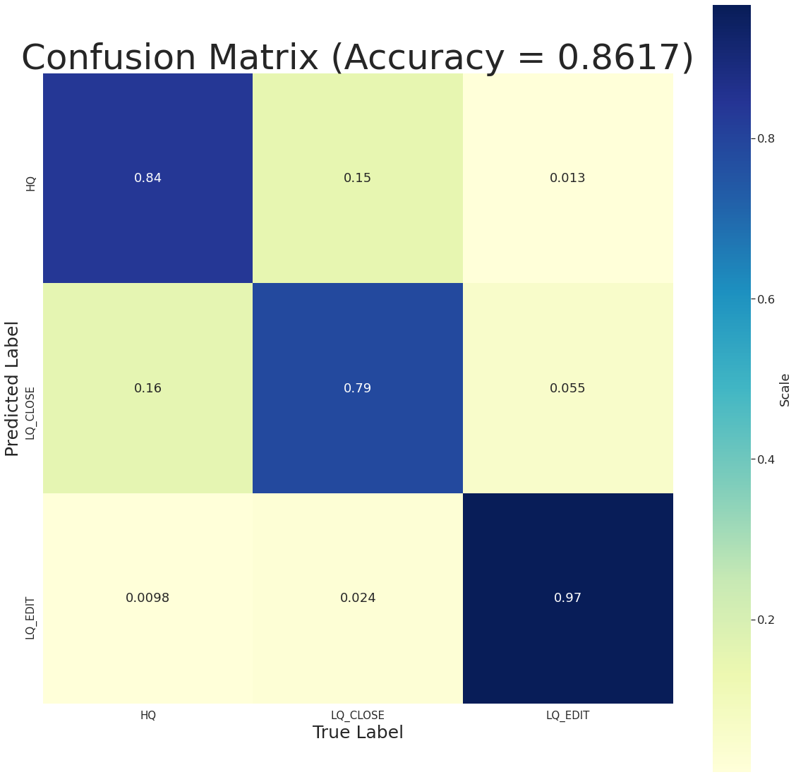

# Quality Analysis and Classification of Stack Overflow questions Using Deep Learning Techniques
 
## Introduction
With the proliferation of deep learning techniques, this decade can be said to the golden age for Natural Language Processing (NLP). Right from simple neural networks to complex pre-trained language models, the deep learning algorithms have proved to be much better in terms of performance than standard machine learning and statistical algorithms. One of the most famous and fundamental tasks in NLP is text classification.
All new models and approaches are almost always first tested on a classification task. This shows how good the algorithm is in finding differences between different data samples. When a model performs good in a classification task, we can use it for pattern recognition, part of speech tagging, various regression tasks, etc.
So, the question arises, why do we need to test the same model on newer datasets if it has already performed well on the previous ones? The answer is that each dataset is unique and has tons of subtle information that we can learn from it. The same model won’t necessarily perform the same on all the classification datasets. And so, in this project, we are going to look at a relatively new dataset, study the challenges and issues faced in it. This is the Stack Overflow questions dataset. 
We will also try two unique approaches on it, bi-directional LSTM and CNN. Finally, we will compare the results, and analyze the information gained from it. 

## Related Work
Some models have already been trained on this new dataset. But, most of them have either implemented basic machine learning algorithms or used complex pre-trained networks such as the BERT model.
Hence, the goal of this project was to take a new direction and try how other models have performed on this dataset. Even though we could cite hundreds of other text classification work done in the past decade, I focused on this dataset because it has unique attributes. It does not consist of simple English sentences like the Wikipedia dataset, Twitter dataset, or movie review dataset. This dataset consists of questions that contain unique terms and words related to the software development fields. Most of them also contain code snippets, which is why the data dictionary will be truncated to around 100,000 words.

## Problem Statement
With the growing popularity of Stack Overflow, it has become the main platform for students, researchers, developers, and others to ask questions relating to computers, especially software. The question askers even earn points for this. And people are helpful in answering the questions, making solving issues in programming easier. But, a lot of times questions are downvoted and never answered. This is mostly deemed due to the poor quality of question asked such that the reader is unable to frame a suitable answer. 
This may not seem a huge problem at the start, but it is really frustrating for an asker to have his/her question left without any answers. Whether it is regarding an assignment, a new framework or something else, people have genuine questions that they cannot figure out on their own. Now, after waiting hours or even days waiting for an answer, they finally lose hope and get lost in the documentation themselves. 
Further, when repeatedly asked questions on Stack Overflow, that are deemed poor quality questions, a user may get banned for a few months or even for lifetime. 
To avoid this, it is suggested that a user reads and rereads their own question before posting it on the platform. This can easily turn a poor-quality question into a good quality question that not only helps the user but also the other users that try searching the same question sometime later in the future. 
But, there isn’t a metric on Stack Overflow that suggests you whether your questions are poor-quality or high-quality. You must figure it out yourself. So, in this project, we will try to work on this problem to develop a model that can easily predict the question quality based on tons of previous data. Hence, the user will know before even posting the question, whether he/she needs to improve or modify the question.

## Technical Approach
We will try two different approaches to solve the problem stated before. First one will be a bi-directional LSTM model which are especially beneficial for long data samples (longer than a one or two sentences). The other approach will be using CNN networks, which are known to perform well for Computer Vision (CV) tasks. It will be interesting to compare their performances and analyze their advantages on this dataset. 
Most of the simple machine learning algorithms implemented by others achieved around 70% accuracies. So the motive today will be to beat this using our neural network deep learning models.

## Experimental Setup
In this section, we will look at the dataset in greater detail as well the experiments performed on it. We will also investigate the preprocessing work required for the dataset as well as visualize some interesting parts of the data. All the code is included in a single python notebook and requires at least a Python 3 environment. This notebook can be easily run to recreate all the plots and results.
Various libraries and frameworks are used for this project. They are all listed at the start as imports and must be installed before running any code, else it may result in an error.

### Data
The dataset used for this project is the Stack Overflow questions dataset found collected by Moore (Data scientist at Kertoft). This dataset can be found on Kaggle.
The dataset consists of over 60,000 data samples that are collected from the Stack Overflow website. These questions were asked in a time period ranging from 2016 to 2020.
The dataset consists of the unique question ID, a question title, main body or content of the question, tags representing the important words (keywords) in the question, creation date of the question as well as the class/label of the question.
The label itself consists of three classes,
1.	High-Quality (HQ), questions that receive a score a more than 30 from the community and is not edited a single time by anyone.
2.	Low-Quality Edited (LQ_EDIT), questions that receive a negative score and multiple edits from the community.
3.	Low-Quality Closed (LQ_CLOSE), questions that were immediately closed by the community due to its extremely poor quality.
These questions are sorted according to their question ID. Also, the main content or text of the questions are in the HTML format and the dates are in the UTC format.

#### Pre-processing
For the purpose of this project, the data is preprocessed in many ways. Since question ID should not have any influence over the quality of the question (it is a unique ID assigned by the website), it is effectively removed from the data. Also, the title and body are combined into a single string for training purposes.
 The tags are also not important in determining the quality since a well framed question could have no tags or a single tag added. Similarly, the date should also not influence the quality of the question. We don’t want the model to get any inference from the date, and so it is removed.
The HTML tags are also removed from the question since they don’t show any semantic importance to the data. Also, the text data cannot be directly passed to our model, we create a word embedding for this data by setting a vocabulary limit and sequence limit on the same. The text is tokenized and converted into sequences of integers that our model can handle.
Finally, the dataset provided by the author is split into two sets, a training set of 45,000 samples and a test set of 15,000 samples. But I have combined the data and split it into a ratio of 80% (48,000) training samples, 10% (6,000) validation samples, and 10% (6,000) test samples.

#### Visualization
As can be seen in the figure 2, the dataset is perfectly balanced with each of the three classes having 20,000 samples each. Hence, there was no requirement of artificially increasing or decreasing the size of any individual class.

Figure 1: Frequency of a sample size

Now, if we look at the figure 2, we can observe an interesting pattern. As the quality of the questions increases, the questions are more likely to be a slightly longer question. The curve of the HQ class has its peak much further than the other classes. This makes sense because when the user takes the time to write a detailed question on the platform, there is likely to be lesser confusion about it and the answerer can understand the meaning and motive behind the question much more easily. 

Figure 2: Dataset Size
 
The data length can also be seen to be skewed to the left. It is found that 95% of the data samples have a maximum length of around 360 words. Hence, we set this as the limit for the word embedding and most of the samples which are shorter are just padded with zeros.

### Experiments
The experiments have been run on two separate models. Since, we want the comparison to be fair, both the models have been created with the number of trainable parameters that are close to each other. 
As discussed before, on this dataset, various approaches like basic machine learning algorithms, RNN, LSTM, BERT have been tried and tested. 
The issue with basic machine learning algorithms is that they cannot achieve the results that deep learning models can on such a huge and complex dataset. Remember, the dataset does not consist of simple English sentences, but various terms and words relating to programming and its frameworks.
BERT could be tried, but even without training, it has over 110 million parameters. Such a model takes up valuable memory resources. The question is whether we need such a model for a single task, or can we achieve appreciable results using simpler models (although we would have to train the whole network)? Hence, I decided to study the results of other deep learning methods given later.
Since simple RNN and LSTM models have already been tried on this new dataset, my goal was to try bi-directional LSTM and study how it helps in relatively long data samples, and CNN, which dominate the Computer Vision field.
Following are the two models studied in this project,
1.	Bi-directional LSTM:
It consists of an Embedding layer as its input. Then we have two bi-directional LSTM layers stacked. The LSTM layers use around 64 hidden neurons. Also, the first LSTM layer returns a sequence that can be directly fed into the second layer. These design decisions were made keeping in mind that the model should reach at least an accuracy of 80% (what others have achieved using other network models).
The final layer is a dense layer using a soft-max activation function so that the output is in a probabilistic format. I have also used binary cross-entropy for calculating the loss since we either observe a label or not. Adam optimizer was used with a learning rate of 1e-4. This rate is reduced depending on the progress on the validation loss.
Early stopping mechanism is also added to stop when the model isn’t improving at all. All this adds up to a total of 13 million parameters.
2.	CNN:
Convolutional Neural Networks (CNN) model consists of a single convolutional layer. The input layer is the same as the previous one, containing an embedding layer. 
Then we have a 1D convolutional (since this is a linear data, i.e. text) followed by a max-pooling layer. We flatten this data and then have a similar dense layer as the first model.
This model also has similar early-stopping and updating learning rate mechanisms as the previous one. This model has a total of 13.5 million trainable parameters, again, close to the previous one.

## Results
Now that we have discussed the dataset as well as the model in detail, let’s look at how they performed after training.

### Model 1 (bi-directional LSTM)
Given in figure 3 is the confusion matrix for the LSTM model. The model achieved an accuracy of 85.1% on the testing dataset. It performed the best on the LQ_EDIT class with around 97% of correct predictions.
One interesting point to note is that the model had a hard time distinguishing between LQ_CLOSE class and HQ class, as 20% of the LQ_CLOSE were predicted as HQ 13% when flipped. 

Figure 3: Confusion matrix for model 1
 
We could collect more data in the future for these two labels to compare if they improve in this area. Now, looking at the metrics in figure 4, we can clearly see the performance on LQ_EDIT questions.

| Precision | Recall	| F1-score |
|:------:|:-------:|:-------:|
| HQ | 0.78 |	0.87	| 0.82 |
| LQ_CLOSE	| 0.81	| 0.76	| 0.78 |
| LQ_EDIT	| 0.97	| 0.92	| 0.95 |
Figure 4: Metrics for model 1

As can be seen, the model did struggle with LQ_CLOSE from the F1-score.

### Model 2 (CNN)
Given in figure 5 is the confusion matrix for the second model.

Figure 5: Confusion matrix for model 2
 
For CNN as well, the model performed its best on the LQ_EDIT class. And again, this model also struggled between LQ_CLOSE and HQ. This pattern for both the models shows that HQ and LQ_CLOSE questions are relatively similar, at least semantically. 
This is interesting because one would expect these two labels to be the one easily distinguishable and LQ_EDIT to be the difficult course. If the dataset could be divided into more categories, we would get a better idea why this is an issue.

| Precision | Recall	| F1-score |
|:------:|:-------:|:-------:|
| HQ	| 0.84 |	0.82	| 0.83 |
| LQ_CLOSE	| 0.79	| 0.83 |	0.81 |
| LQ_EDIT	| 0.97	| 0.93 |	0.95 |
Figure 6: Metrics for model 2

For the metrics as well both the models have performed similarly. This is especially appreciable for the CNN network since it is primarily use on CV tasks. Also, both the models are similar in their complexity, which explains the similarities in their learnings from the data.

### Accuracy and Loss
Now let’s look at the accuracy and the loss on both the models for training as well as the validation set. 

Figure 7: Accuracy
 
From the figure 7, blue line is for the bi-directional LSTM model and green line is for the CNN model. The strong line is for the training accuracies, while dotted lines are for the validation accuracies. The same is true for the loss plot in figure 8.

Figure 8: Loss
 
The models have trained well right from the start. The first few epochs are crucial here, where the validation metrics slowly increase. After 3-4 epochs, both the models start over-fitting on the training dataset. Since, early stopping methods were defined, the models stopped before the original limit of 25 epochs. We can also see that the validation accuracies are like our test accuracies that can be seen in the confusion matrix. Overall, both the models performed well against this complex dataset with models that weren’t too complex.

## Conclusions and Future Work
Hence, we looked at the new and updated Stack Overflow dataset. We saw the issues and complexity of this dataset as well as the models used to perform our tasks on the same. We consistently got a respectable 85% plus accuracy on both the models, which is especially great considering the simplicity of these models in comparison to other deep-learning models.
Although a lot of models have already been trained on this dataset, they concentrate on classifying the quality of the questions. Another interesting direction as also stated by the author of the dataset is to be able to predict the tags when the user has completed typing his/her questions. The dataset has over 6,000 unique tags. In such as complex task, BERT would really shine, and it would a good task as a follow-up to this project. Some cloud services (such as Google Clouds TPU or Amazons AWS services) could be used for such a complex task, which is effectively a multi-class multi-label classification/prediction task. Since, this is an ever-increasing dataset, it could be collected each year to see how the model performs over the data of the upcoming years. 

## References
1. https://www.kaggle.com/imoore/60k-stack-overflow-questions-with-quality-rate
2. https://stackoverflow.com/